# Botwok — UI walkthrough: wireframe vs. built screen

Each section shows the designed wireframe (from `architecture/24-wireframes.md`) next to a screenshot of the running application, plus what happens on the screen and how it was verified. Screenshots were taken against the local stack (FastAPI + workers + Next.js) on 2026-10-08 with the seeded demo workspace.

## 1. Login

**Route:** `/login`  
**What happens here:** Email + password sign-in; access token kept in memory, rotating refresh cookie.  
**Verified:** Signed in as the seeded demo user; redirected to the workspace dashboard.

<table><tr><th width="50%">Wireframe (design)</th><th width="50%">Built screen</th></tr><tr><td>

```text
┌──────────────────────────────────────────────────────────────────────────┐
│                                                                  ◐ Theme │
│                               ▣ Botwok                                   │
│                ┌──────────────────────────────────────────┐              │
│                │ Sign in                                  │              │
│                │ Email                                    │              │
│                │ ┌──────────────────────────────────────┐ │              │
│                │ │ you@company.com                      │ │              │
│                │ └──────────────────────────────────────┘ │              │
│                │ Password                    (Forgot?)    │              │
│                │ ┌──────────────────────────────────────┐ │              │
│                │ │ ••••••••••••                  ◎ show │ │              │
│                │ └──────────────────────────────────────┘ │              │
│                │ ☐ Keep me signed in on this device       │              │
│                │ [            Sign in                   ] │              │
│                │ No account? (Create one)                 │              │
│                └──────────────────────────────────────────┘              │
│           Instance: botwok.local:3000 · v0.9.2 · local install           │
└──────────────────────────────────────────────────────────────────────────┘
```

</td><td>

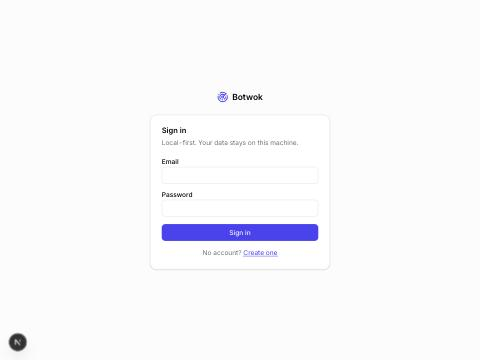

</td></tr></table>

## 2. Signup

**Route:** `/signup`  
**What happens here:** Creates the first user, who becomes owner of a new workspace.  
**Verified:** Form renders; signup API covered by integration tests (rotation + reuse detection).

<table><tr><th width="50%">Wireframe (design)</th><th width="50%">Built screen</th></tr><tr><td>

```text
┌──────────────────────────────────────────────┐
│ Create your account                ▣ Botwok  │
│ ⓘ Joining Acme Co as editor · from Jo Li     │
│ Full name  [ Sam Branch                    ] │
│ Email      [ sam@acme.com           locked ] │
│ Password   [ ••••••••••••             ◎    ] │
│            ▓▓▓▓▓▓░░ strong · 12+ chars       │
│ [Create account]      Have one? (Sign in)    │
└──────────────────────────────────────────────┘
```

</td><td>

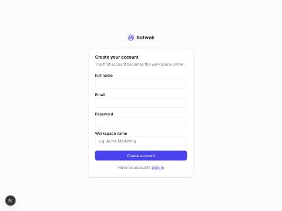

</td></tr></table>

## 3. Onboarding

**Route:** `/onboarding`  
**What happens here:** Six-step wizard: workspace → brand → import from website → connect account → goals → done.  
**Verified:** Step 1 renders with slug + timezone defaults; later steps call the brand/import/social APIs.

<table><tr><th width="50%">Wireframe (design)</th><th width="50%">Built screen</th></tr><tr><td>

```text
┌─────────────────────────────────────────────────────────────────────────────────────────┐
│ ▣ Botwok                                                          (Exit to dashboard)   │
│ ① Workspace ─ ② Brand ─ ●③ Import ─ ④ Connect ─ ⑤ Goals ─ ⑥ Done                        │
├─────────────────────────────────────────────────────────────────────────────────────────┤
│ Import from your website                                                                │
│ We read public pages of acme.com and propose brand fields. Nothing is saved until you   │
│ accept it.                                                                              │
│ ┌───────────────────────────────────┐  ┌────────────────────────────────────────────┐   │
│ │ Progress                          │  │ Proposed fields                       ✦ AI │   │
│ │ ✓ Fetch pages (12 of 12)    6.2s  │  │ Description  "Specialty roaster…" ✓ ✎ ✕    │   │
│ │ ✓ Extract text & images     2.1s  │  │ Audience     "Home baristas 25–45" ✓ ✎ ✕   │   │
│ │ ⟳ Infer voice & tone        …     │  │ Tone         friendly · expert ✓ ✎ ✕       │   │
│ │ ○ Suggest content pillars         │  │ Pillars (4)  ▸ Brewing guides … ✓ ✎ ✕      │   │
│ │ ○ Detect competitors mentioned    │  │ Colors       ■ #3B2A20 ■ #E8D8C3  ✓ ✕      │   │
│ │ Cost so far $0.012                │  │ Competitors  ▸ 2 found ☐ add as tracked    │   │
│ │ ▸ Pages read (12)                 │  │ Each field: hover → source page + snippet  │   │
│ └───────────────────────────────────┘  └────────────────────────────────────────────┘   │
├─────────────────────────────────────────────────────────────────────────────────────────┤
│ (Back)                                            (Skip this step)  [Accept & continue] │
└─────────────────────────────────────────────────────────────────────────────────────────┘
```

</td><td>

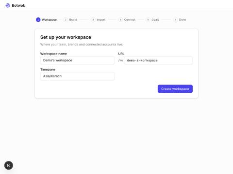

</td></tr></table>

## 4. Workspace

**Route:** `/w/{slug}/settings/team`  
**What happens here:** Workspace switcher in the header; members, roles and invitations on the Team page.  
**Verified:** Owner listed with role; invite dialog wired to POST invitations.

<table><tr><th width="50%">Wireframe (design)</th><th width="50%">Built screen</th></tr><tr><td>

```text
┌─────────────────────────────────────────────────────────────────────────────────────────┐
│ Acme Co  ✎                                    (Workspace settings)  [+ New brand]       │
│ Owner: Sam Branch · 3 brands · 7 members · TZ Europe/Berlin                             │
├──────────────────────────────────────────────────────────┬──────────────────────────────┤
│ Brands                                                   │ Members           (Invite +) │
│ ┌──────────────┐ ┌──────────────┐ ┌──────────────┐       │ (SB) Sam      owner          │
│ │ ◆ Acme Coffee│ │ ◆ Acme Tea   │ │ ◆ Acme B2B   │       │ (JL) Jo Li    admin          │
│ │ li ig x  ●3  │ │ ig pi    ●1  │ │ li       ●0  │       │ (RK) Ravi K   approver       │
│ │ 4 pending ✓  │ │ 0 pending    │ │ 1 failed ✗   │       │ +4 more · (Manage team)      │
│ │ [Open]       │ │ [Open]       │ │ [Open]       │       ├──────────────────────────────┤
│ └──────────────┘ └──────────────┘ └──────────────┘       │ Usage this month             │
├──────────────────────────────────────────────────────────┤ AI   $31.20 / $100 ▓▓▓░░░░   │
│ Account health                                           │ Posts published   46         │
│ ● 9 active  ○ 1 expired  ○ 0 revoked  ● 1 error  (Fix →) │ Media storage  2.1 GB        │
├──────────────────────────────────────────────────────────┤ Runs 128 · failed 3          │
│ Your workspaces                                          │                              │
│ ▣ Acme Co (current) · ▣ Side Project · (+ Create)        │                              │
└──────────────────────────────────────────────────────────┴──────────────────────────────┘
```

</td><td>

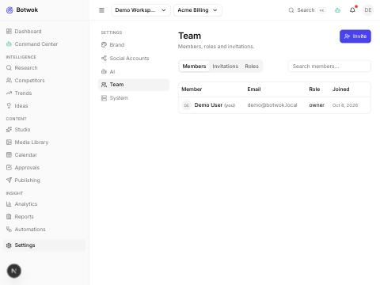

</td></tr></table>

## 5. Dashboard

**Route:** `/w/{slug}/dashboard`  
**What happens here:** KPIs with period comparison, what-to-do-next recommendations, upcoming schedule, pending approvals, recent AI runs, account health.  
**Verified:** All widgets render honest empty states before any data exists; brand selector in header populates metrics.

<table><tr><th width="50%">Wireframe (design)</th><th width="50%">Built screen</th></tr><tr><td>

```text
┌─────────────────────────────────────────────────────────────────────────────────────────┐
│ Dashboard · Acme Coffee            Period: Last 7 days ▾  vs prev ▾      (Customize)    │
├────────────────────┬────────────────────┬────────────────────┬──────────────────────────┤
│ Reach        48.2k │ Eng. rate    4.1%  │ Published     12   │ Followers (net)   +318   │
│ ▲ 12% vs prev      │ ▼ 0.3 pt           │ ▲ 2                │ ▲ 9%   ▁▂▃▅▆▇            │
├────────────────────┴────────────────────┴──────┬─────────────┴──────────────────────────┤
│ Needs your attention                       (6) │ Next 7 days               (Calendar →) │
│ ⏸ 4 posts awaiting your approval     [Review]  │ Today 09:00 li ● Scheduled "Q4 plan…"  │
│ ✗ 1 post failed · ig · token expired [Fix]     │ Today 13:30 ig ● Needs Review "Latte…" │
│ ⚠ li token expires in 3 days      [Reconnect]  │ Wed   10:00 x  ● Approved "Decaf…"     │
│ ⚠ AI budget at 82% this month         [View]   │ Thu   09:00 li ● Scheduled "Supplier…" │
│ ⏸ Automation "News→LinkedIn" waiting [Open]    │ (+ 3 more)                             │
├────────────────────────────────────────────────┼────────────────────────────────────────┤
│ ✦ AI insights & recommendations                │ Trending now              (Trends →)   │
│ • Carousels on ig get 2.3× saves vs single     │ ▇ Cold brew at home  92  ▁▃▅▇  4 src   │
│   image (n=18, 30d)    (Accept) (Dismiss) (?)  │ ▆ Decaf revival      78  ▁▂▄▅  7 src   │
│ • Post li Tue/Wed 08–10 (+31% eng.)            │ (Create ideas)                         │
├────────────────────────────────────────────────┼────────────────────────────────────────┤
│ Recently published                             │ Running now                            │
│ li "Supplier story"  2d  1.2k reach  5.3%  ↗   │ ⟳ Run "Weekly ideas" 3/5 $0.04 (Open)  │
│ ig "Pour-over 101"   3d  3.4k reach  6.1%  ↗   │ ⟳ Sync analytics · li ig  (Open)       │
└────────────────────────────────────────────────┴────────────────────────────────────────┘
```

</td><td>

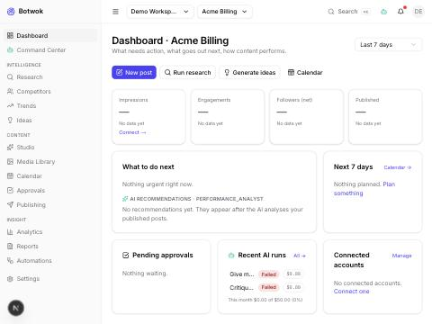

</td></tr></table>

## 6. AI Assistant / Command Center

**Route:** `/w/{slug}/command-center`  
**What happens here:** Prompt box with slash commands, run timeline (plan checklist with ✓/⟳/✗, durations, cost), sources, reasoning summary, generated content, actions awaiting approval, run history.  
**Verified:** Run started from the UI; without provider keys the run fails fast and the failure is shown in the timeline (transparency contract).

<table><tr><th width="50%">Wireframe (design)</th><th width="50%">Built screen</th></tr><tr><td>

```text
┌────────────────────┬─────────────────────────────────────────────────────────────────────────────┐
│ Runs   [+ New run] │ Run r_01J9…  "Plan next week of li posts from AI-in-retail news"            │
│ Brand ▾  By ▾      │ ⟳ running · step 3/6 · 00:42 · 18.2k tok · $0.087   (■ Cancel ⌘.)           │
├────────────────────┼──────────────────────────────────────────────┬──────────────────────────────┤
│ (Search runs…)     │ You  /plan next week of li posts from        │ ⏸ AWAITING APPROVAL (1)      │
│ Status ▾  Agent ▾  │      AI-in-retail news for @Acme Coffee      │ ┌──────────────────────────┐ │
│ ────────────────── │ ──────────────────────────────────────────── │ │ Schedule 5 posts         │ │
│ ⟳ LinkedIn week    │ ✓ Planning…  plan v1 · 6 steps      2.1s ▸   │ │ li · Mon–Fri 09:00 CET   │ │
│   2m · $0.09       │ ✓ 1 research  Find retail-AI news  14.3s ▸   │ │ publishing.propose_      │ │
│ ✓ Competitor rpt   │ ✓ 2 trend     Score 12 topics       3.0s ▸   │ │   schedule · step 6      │ │
│   1h · $0.31       │ ⟳ 3 ideation  Generate 10 ideas     8s… ▾    │ │ [Approve] (Reject) (View)│ │
│ ✗ Trend scan       │ ┌─────────────────────────────────────────┐  │ └──────────────────────────┘ │
│   Tue · $0.02      │ │ agent ideation · cheap → ollama/llama3.1│  │ ──────────────────────────── │
│ ⏸ IG carousel      │ │ Tool calls                              │  │ [Output 5] (Sources 14) (Why)│
│   Mon · awaiting   │ │  ✓ memory.search "pillars"       120ms  │  │ ☐ ✦ li "Most retailers…"     │
│ ⊘ Blog repurpose   │ │  ✓ research.list_sources  14 src  80ms  │  │  AI Generated · critic 82    │
│   Sep 30 · cancel  │ │  ⟳ LLM call  in 4.1k tok · out …        │  │  (Open in Studio) (Approve)  │
│ ▸ automation runs  │ │ Sources used 6 ▸  4.1k tok  $0.003      │  │  (Schedule) (Regen) (Discard)│
│                    │ │ (Raw I/O) (Retry step) (Copy ids)       │  │ ☐ ✦ li "3 ways stores use…"  │
│ (Load more)        │ └─────────────────────────────────────────┘  │  ⟳ critic running…           │
│                    │ ○ 4 writer    Draft 5 li posts               │ ☐ ✦ li "Inventory bots…"     │
│                    │ ○ 5 critic    Score + fact_check             │  ○ waiting for step 5        │
│                    │ ○ 6 propose   Schedule 5 posts     ⏸ gate    │ (Approve selected) (Export)  │
│                    │ ──────────────────────────────────────────── │                              │
│                    │ ┌ Follow up… /command @mention ──────────┐   │                              │
│                    │ └────────────────────────────── [Send ⌘↵]┘   │                              │
└────────────────────┴──────────────────────────────────────────────┴──────────────────────────────┘
```

</td><td>

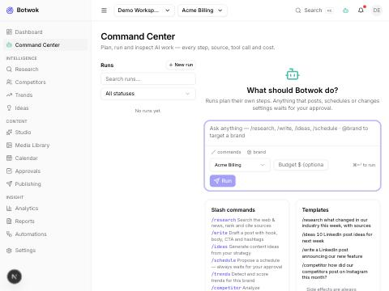

</td></tr></table>

## 7. Research

**Route:** `/w/{slug}/research`  
**What happens here:** New run form (query, scope, depth, recency, brand), ranked sources with credibility/relevance badges, source drawer, history.  
**Verified:** Form submits to POST /research/runs; pipeline runs through the worker (search → fetch → extract → dedupe → score → persist).

<table><tr><th width="50%">Wireframe (design)</th><th width="50%">Built screen</th></tr><tr><td>

```text
┌──────────────────────────────────────────────────────────────────────────────────────────────────┐
│ Research · Acme Coffee            [Results] (History) (Feeds & keywords)     [+ New run]         │
├──────────────────────────────┬───────────────────────────────────────────────────────────────────┤
│ NEW RUN                      │ "cold brew trends 2026" · ✓ completed · 38 sources · $0.09 (Run ▸)│
│ Query                        │ Sort: relevance ▾  Credibility ▾  Type ▾  ☐ Saved only  (Search…) │
│ [ cold brew trends 2026     ]│ ───────────────────────────────────────────────────────────────── │
│ Scope                        │ 1 ★94 ● high  nytimes.com · News · Oct 4             (Save) (Cite)│
│ ☑ Web  ☑ News  ☐ Social      │   Summary: cold brew retail sales up 18% YoY; growth at home…     │
│ ☑ Competitor sites  ☐ RSS    │   keywords: cold brew · RTD · at-home   used in 0 items           │
│ Depth ○ Quick ◉ Std ○ Deep   │ 2 ★90 ● high  sca.coffee · Web · Sep 28             ✓Saved (Cite) │
│ Dates [Last 30 days ▾]       │   Summary: survey of home brewing equipment ownership…            │
│ Brand [Acme Coffee ▾]        │ 3 ★72 ● med   reddit.com/r/coffee · Social · Oct 6  (Save) (Cite) │
│ Est. ~40 sources · ≤ $0.12   │   ⚠ user-generated content — verify before citing                 │
│ [Run research ⌘↵]            │ 4 ★65 ● med   brewbros.com/blog · Compet. · Oct 1   (Save) (Cite) │
│                              │ (Load 34 more)                    ✦ Summary of findings ▸         │
└──────────────────────────────┴───────────────────────────────────────────────────────────────────┘
```

</td><td>

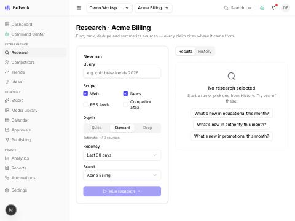

</td></tr></table>

## 8. Competitors

**Route:** `/w/{slug}/competitors`  
**What happens here:** Competitor cards with per-platform availability badges (official API / public web / search / user-provided / not collected), sync, compare.  
**Verified:** Empty state explains the no-scraping rule; Add Competitor dialog posts to /competitors and triggers a profile sync.

<table><tr><th width="50%">Wireframe (design)</th><th width="50%">Built screen</th></tr><tr><td>

```text
┌──────────────────────────────────────────────────────────────────────────────────────────────────┐
│ Competitors · Acme Coffee  ▦ Grid ≡ List  Platform ▾ Sync ▾ Sort ▾  (Compare 2 ▸) [+ Competitor] │
├────────────────────────────────┬────────────────────────────────┬────────────────────────────────┤
│ ☑ Brew Bros                  ⋯ │ ☑ Bean There                 ⋯ │ ☐ Roast Lab                  ⋯ │
│ brewbros.com                   │ beanthere.co                   │ roastlab.io                    │
│ ig yt li tt    ✓ synced 2h     │ ig pi          ⟳ syncing 40%   │ li x           ✗ sync failed   │
│ Posts/wk ▁▃▅▃▆▅▇ 6.2           │ Posts/wk ▂▂▃▂▂▃▂ 2.1           │ Posts/wk —                     │
│ Followers 48k  ▲3% 30d         │ Followers 12k  ▲1% 30d         │ x: Not collected (platform     │
│ Official API · User-provided   │ Official API · Public web      │ restriction)                   │
│ [Open]                         │ [Open]                         │ (Retry sync) [Open]            │
└────────────────────────────────┴────────────────────────────────┴────────────────────────────────┘
```

</td><td>

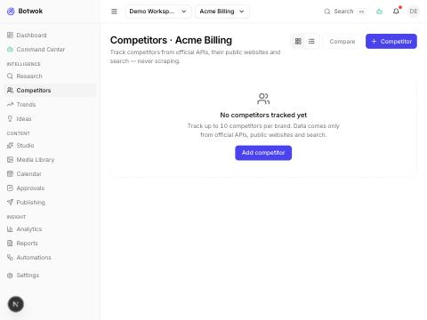

</td></tr></table>

## 9. Competitor Detail

**Route:** `/w/{slug}/competitors/{id}`  
**What happens here:** Profile cards per platform, tabs Overview · Posts · Pillars & Hooks · Visual & Tone · Website & Blog · News · Gaps & Opportunities · Reports.  
**Verified:** Rendered after adding a competitor with a website profile (public-web availability).

<table><tr><th width="50%">Wireframe (design)</th><th width="50%">Built screen</th></tr><tr><td>

```text
┌──────────────────────────────────────────────────────────────────────────────────────────────────┐
│ ◀ Competitors / Brew Bros  brewbros.com ↗  ✓ synced 2h   (Sync now) (Compare ▸) (✦ Report)       │
├───────────────────────┬────────────────────────┬────────────────────────┬────────────────────────┤
│ ig  @brewbros         │ yt  Brew Bros TV       │ li  company/brewbros   │ tt  @brewbros          │
│ 48.2k followers       │ 9.1k subscribers       │ 5.3k followers         │ —                      │
│ 6.2 posts/wk          │ 0.5 videos/wk          │ 3.0 posts/wk           │ —                      │
│ ● Official API        │ ● Official API         │ ● User-provided        │ ○ Not collected        │
│                       │                        │                        │ (platform restriction) │
├───────────────────────┴────────────────────────┴────────────────────────┴────────────────────────┤
│ [Overview] Posts · Pillars & Hooks · Visual & Tone · Website & Blog · News · Gaps · Reports      │
├────────────────────────────────────────────────┬─────────────────────────────────────────────────┤
│ Posting frequency 90d     by platform ▾        │ You vs Brew Bros (30d)                          │
│ ▁▂▃▅▃▆▅▇▆▅▆▇   ig ━  li ┄                      │ Posts/wk       4.0   vs  6.2                    │
│ Formats  carousel 41% · video 33% · image 26%  │ Eng. rate      4.1%  vs  3.2%   (ig only)       │
│ ✦ Pillars  education 38% · product 30% · …     │ Top post  ig "Iced oat latte" 2.1k ↗            │
│ Best day/time  Tue 08:00 (ig, n=64)            │ li figures: User-provided, 2 snapshots          │
└────────────────────────────────────────────────┴─────────────────────────────────────────────────┘
```

</td><td>

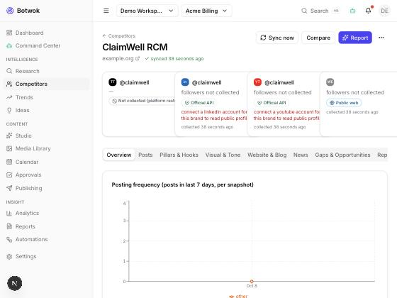

</td></tr></table>

## 10. Trends

**Route:** `/w/{slug}/trends`  
**What happens here:** Trend cards with score, velocity sparkline, platforms, keywords; scan now; create ideas from a trend.  
**Verified:** Empty state + Scan now wired to POST /trends/scan (deterministic burst scoring over research/competitor signals).

<table><tr><th width="50%">Wireframe (design)</th><th width="50%">Built screen</th></tr><tr><td>

```text
┌──────────────────────────────────────────────────────────────────────────────────────────────────┐
│ Trends · Acme Coffee  Window 7d ▾  Platform ▾  Source ▾  State ▾  Score ≥60 ▾  (Search) [⟳ Scan] │
├────────────────────────────────────────────────┬─────────────────────────────────────────────────┤
│ ▲ Cold brew at home         Score 92           │ ▲ Decaf revival             Score 78            │
│ Velocity ▁▂▃▅▇  +38%/wk  ● rising              │ Velocity ▁▂▂▄▅  +12%/wk  ● emerging             │
│ 14 sources · news 6 · web 5 · social 3         │ 7 sources · news 4 · social 3                   │
│ Platforms  ig tt pi                            │ Platforms  ig li                                │
│ Keywords cold brew · nitro · concentrate       │ Keywords decaf · swiss water · sleep            │
│ ✦ Fit high — pillar "Brewing guides"           │ ✦ Fit medium — no matching pillar               │
│ (Create ideas from trend) (Details) (✕)        │ (Create ideas from trend) (Details) (✕)         │
├────────────────────────────────────────────────┴─────────────────────────────────────────────────┤
│ Last scan 06:00 · 212 signals · 9 trends · next scan 18:00 (Automations)   Showing 2 of 9 ▸      │
└──────────────────────────────────────────────────────────────────────────────────────────────────┘
```

</td><td>

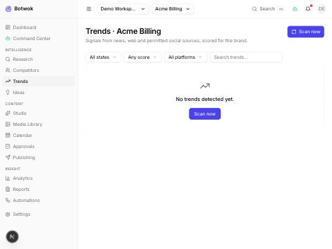

</td></tr></table>

## 11. Content Ideas

**Route:** `/w/{slug}/ideas`  
**What happens here:** Kanban New · Shortlisted · Promoted · Discarded (or table), generate-ideas dialog, promote to Studio.  
**Verified:** Seeded idea appears in the New column with pillar/type/platform tags and a Promote action.

<table><tr><th width="50%">Wireframe (design)</th><th width="50%">Built screen</th></tr><tr><td>

```text
┌──────────────────────────────────────────────────────────────────────────────────────────────────┐
│ Ideas · Acme Coffee  ▥ Board ≡ Table  Group Pillar ▾  Type ▾ Platform ▾ Source ▾ [✦ Generate] (+)│
├───────────────────────┬────────────────────────┬────────────────────────┬────────────────────────┤
│ EDUCATION (12)      ⋯ │ PRODUCT (7)         ⋯  │ COMMUNITY (5)       ⋯  │ ADVOCACY (3)        ⋯  │
│ ┌───────────────────┐ │ ┌───────────────────┐  │ ┌───────────────────┐  │ ┌───────────────────┐  │
│ │✦ 5 cold brew      │ │ │✦ Behind our decaf │  │ │  Latte art contest│  │ │✦ Why we pay 30%   │  │
│ │ mistakes          │ │ │ process           │  │ │ ugc · image · ig  │  │ │ above fair trade  │  │
│ │ educational       │ │ │ behind_the_scenes │  │ │ ★71 manual · Jo L.│  │ │ authority         │  │
│ │ carousel · ig pi  │ │ │ video · yt ig     │  │ │ → in Studio ↗     │  │ │ text · li         │  │
│ │ ★86 ↳ trend       │ │ │ ★79 ↳ research    │  │ └───────────────────┘  │ │ ★83 ↳ comp. gap   │  │
│ │ (Promote ▸)     ⋯ │ │ │ (Promote ▸)     ⋯ │  │                        │ │ (Promote ▸)     ⋯ │  │
│ └───────────────────┘ │ └───────────────────┘  │                        │ └───────────────────┘  │
│ (+ Idea)              │                        │                        │                        │
└───────────────────────┴────────────────────────┴────────────────────────┴────────────────────────┘
```

</td><td>

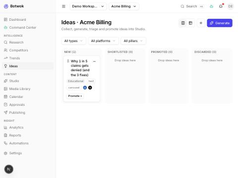

</td></tr></table>

## 12. Content Studio

**Route:** `/w/{slug}/studio/{id}`  
**What happens here:** Three columns: navigator (master + platform variants, versions), editor (hook/body/CTA, hashtags, per-platform character budget, preview), right panel (AI, sources, SEO, media, critic, approval, schedule).  
**Verified:** Seeded item opened: master + LinkedIn variant, versions list, 274/3,000 character budget, status chips; autosave shows 'All changes saved'.

<table><tr><th width="50%">Wireframe (design)</th><th width="50%">Built screen</th></tr><tr><td>

```text
┌──────────────────────────────────────────────────────────────────────────────────────────────────┐
│ ◀ Studio / Q4 cold brew launch  ● Needs Review ▾  (SB)(JL)  (✦ Repurpose) (Request approval) ⋯   │
├─────────────────────┬────────────────────────────────────────────────┬───────────────────────────┤
│ MASTER              │ [Master] li  ig  x  th  (+)   ◉ Edit ○ Preview │ [✦ AI] Sources  SEO  Media│
│ ● Draft · v7        │ HOOK                                   62/150  │ Critic  Approval  Schedule│
│ Q4 cold brew launch │ Most Q4 plans fail in week one. Here is how    │ ──────────────────────────│
│ ─────────────────── │ three roasters avoided it.                     │ ✦ CRITIC  (variant li)    │
│ VARIANTS      (+)   │ BODY                               1,240/3,000 │ Quality      82 ▓▓▓▓▓▓▓▓░░│
│ li ● Needs Review   │ B  I  •  1.  ↗  @  {var}   (✦ Regenerate ▾)    │ Brand fit    ✓ 90         │
│ ig ● AI Generated   │ Cold brew demand rose 18% this year [1], and…  │ Platform     ✓ li rules   │
│ x  ● Draft  ⚠ 312   │ …                                              │ Policy risk  ✓ none found │
│ th ● Approved       │ CTA                                     38/150 │ FACT-CHECK (3 claims)     │
│ ─────────────────── │ Get the free brew guide → link in bio          │ ✓ "+18% demand" [1] nrf   │
│ VERSIONS            │ HASHTAGS  li 3 · recommended ≤ 5               │ ? "three roasters" no src │
│ v7 Sam · 2m         │ #coldbrew ✕  #coffee ✕  #retail ✕  (+)         │ ✗ "since 1990" vs [4]     │
│ v6 ✦ writer · 1h    │ ALT TEXT  ✓ 2 of 2 images described            │ SUGGESTIONS               │
│ v5 ✦ repurposer     │ MEDIA  [▣ 1] [▣ 2] (+ Add) (Carousel ▸)        │ • Cite claim 2     (Apply)│
│ (Compare ▸)         │ ────────────────────────────────────────────   │ • Remove claim 3   (Apply)│
│ ─────────────────── │ li 1,340/3,000 ✓  ig 1,340/2,200 ✓  x 312/280 ✗│ (Re-run) critic · balanced│
│ Campaign Q4 launch  │ ● Autosaved 5s · v7         (Discard) [Save ⌘S]│ $0.004 · run ↗            │
│ Pillar Brewing      │                                                │                           │
└─────────────────────┴────────────────────────────────────────────────┴───────────────────────────┘
```

</td><td>

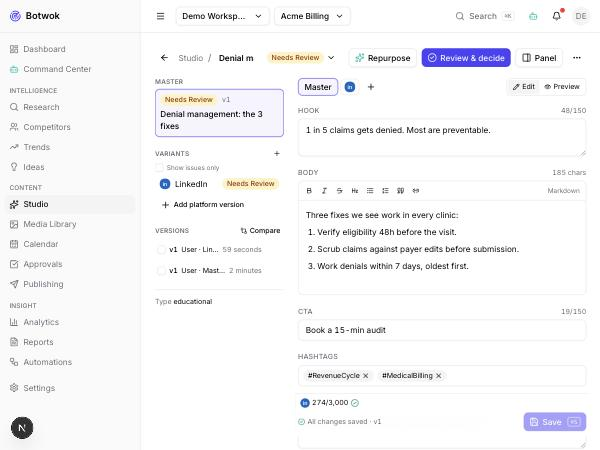

</td></tr></table>

## 13. Media Library

**Route:** `/w/{slug}/media`  
**What happens here:** Grid with filters, upload (presigned PUT), generate image, resize for platform, background removal.  
**Verified:** Empty state renders; upload and generate paths wired to /media routes (S3-compatible store running locally).

<table><tr><th width="50%">Wireframe (design)</th><th width="50%">Built screen</th></tr><tr><td>

```text
┌──────────────────────────────────────────────────────────────────────────────────────────────────┐
│ Media Library · Acme Coffee                         (✦ Generate image) (Upload) [+ Add]          │
├───────────────────────────────────────────────────────────────────┬──────────────────────────────┤
│ Type ▾  Brand ▾  Source ◉ All ○ Uploaded ○ ✦ Generated  (Search…) │ ✦ beans.png              ✕   │
│ ┌──────────┐ ┌──────────┐ ┌──────────┐ ┌──────────┐ ┌──────────┐  │ Generated · Oct 7 · 1024²    │
│ │ ▣ image  │ │ ▶ 0:32   │ │ ▣ ✦      │ │ ▦ 6 sl.  │ │ ▣ logo   │  │ provider/model ▸ prompt ▸    │
│ │ 1080²    │ │ 9:16     │ │ 1024²    │ │ carousel │ │ svg      │  │ Alt [Roasted beans on…   ]   │
│ └──────────┘ └──────────┘ └──────────┘ └──────────┘ └──────────┘  │ (✦ Suggest alt text)         │
│ latte.jpg    reel.mp4     beans.png    guide-car…   logo.svg      │ DERIVED FILES                │
│ used 3×      used 1×      unused       used 1×      brand asset   │ 1080×1350 ig 4:5      ⋯      │
│ ☐ select · (Bulk ▾)                            Showing 5 of 412   │ 1000×1500 pi 2:3      ⋯      │
│                                                                   │ beans-nobg.png        ⋯      │
│                                                                   │ USED IN "Q4 launch" li ↗     │
│                                                                   │ (Resize ▾) (Remove bg)       │
│                                                                   │ (Download) (Delete)          │
└───────────────────────────────────────────────────────────────────┴──────────────────────────────┘
```

</td><td>

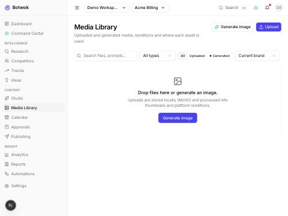

</td></tr></table>

## 14. Calendar

**Route:** `/w/{slug}/calendar`  
**What happens here:** Month/week/day/list/board views, filters, drag-and-drop rescheduling, unscheduled tray, timezone selector, quick create.  
**Verified:** Month view in the brand timezone; the approved LinkedIn post appears in the Unscheduled tray ready to drag onto a day.

<table><tr><th width="50%">Wireframe (design)</th><th width="50%">Built screen</th></tr><tr><td>

```text
┌──────────────────────────────────────────────────────────────────────────────────────────────────┐
│ Calendar  ◀ Oct 2026 ▶ (Today)  [Month] Week Day List Board  TZ Europe/Berlin ▾  Filters(3)▾ (+) │
├─────────────────────┬──────────┬──────────┬──────────┬──────────┬──────────┬──────────┬──────────┤
│ UNSCHEDULED ✓ (4)   │ Mon 5    │ Tue 6    │ Wed 7    │ Thu 8    │ Fri 9    │ Sat 10   │ Sun 11   │
│ drag onto a day     │ li●09:00 │ ig●13:30 │          │ x ●10:00 │ li●09:00 │          │          │
│ ▣ x "Decaf myths"   │ Published│ Review   │          │ Approved │ Scheduled│          │          │
│   ● Approved        │          │ ig●08:00 │ ✦ idea   │          │ ig●12:00⚠│          │          │
│ ▣ ig "Latte art"    │          │ Failed ✗ │ Draft    │          │ Queued   │          │          │
│   ● Approved        │          │          │          │          │          │          │          │
│ (Show all)          │          │          │          │          │          │          │          │
├─────────────────────┴──────────┴──────────┴──────────┴──────────┴──────────┴──────────┴──────────┤
│ ⚠ Fri 9 · ig @acmecoffee: 1 more post would exceed the Instagram API publish limit for 24h (View)│
└──────────────────────────────────────────────────────────────────────────────────────────────────┘
```

</td><td>

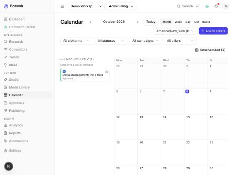

</td></tr></table>

## 15. Approvals

**Route:** `/w/{slug}/approvals`  
**What happens here:** Pending inbox grouped by brand, full per-platform preview, risk level, provenance, Approve / Request changes / Reject with comment, bulk approve.  
**Verified:** Approved the seeded LinkedIn item from this screen → content became `approved`, toast 'scheduling is unlocked', inbox emptied.

<table><tr><th width="50%">Wireframe (design)</th><th width="50%">Built screen</th></tr><tr><td>

```text
┌─────────────────────────────────┬────────────────────────────────────────────────────────────────┐
│ Pending (6)  Mine ▾  Brand ▾    │ "Q4 cold brew launch" · li variant · v7      (Open in Studio ↗)│
│ ☐ Select all   (Bulk approve)   │ Requested by Sam · 2h ago · "Ready for Tue launch"             │
│ ◆ ACME COFFEE (4)               │ [li] ig  x  th    ◉ Preview ○ Text ○ Diff vs last approved     │
│ ☐ ● li "Q4 cold brew…"          │ ┌──────────────────────────────────────────────────────────┐   │
│   Sam · 2h · due today          │ │ (Acme Coffee) · 1st                                      │   │
│ ☐ ● ig "Latte art…"             │ │ Most Q4 plans fail in week one. Here is how three…       │   │
│   ✦ automation · 5h             │ │ [ image 1 / 2 ]                         …see more        │   │
│ ☐ ● x  "Decaf myths"            │ └──────────────────────────────────────────────────────────┘   │
│ ◆ ACME TEA (2)                  │ Critic 82 · brand 90 · platform ✓ · policy ✓                   │
│ ☐ ● pi "Matcha guide"           │ Fact-check 1 ✓ · 1 ? unverified · 1 ✗ contradicted  (View)     │
│ (Approval policies ↗)           │ Sources 3 ▸   ✦ writer + repurposer · 2 runs · $0.05 ▸         │
│                                 │ Comment [ Optional for approve, required otherwise      ]      │
│                                 │ [Approve ⌘↵]  (Request changes)  (Reject)        ◀ 1 of 6 ▶    │
└─────────────────────────────────┴────────────────────────────────────────────────────────────────┘
```

</td><td>

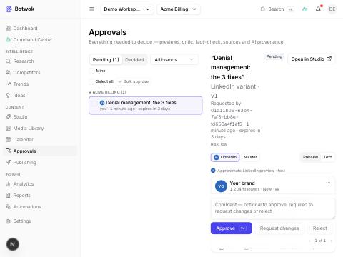

</td></tr></table>

## 16. Publishing

**Route:** `/w/{slug}/publishing`  
**What happens here:** Queue by status with attempts and next retry, failed/dead-letter actions, published list with platform links/delete, platform health strip.  
**Verified:** Renders with empty queue; health strip reports no connected accounts (OAuth app credentials required).

<table><tr><th width="50%">Wireframe (design)</th><th width="50%">Built screen</th></tr><tr><td>

```text
┌──────────────────────────────────────────────────────────────────────────────────────────────────┐
│ Publishing   Queue [All ▾] Platform ▾ Account ▾ Brand ▾   (Search)          (Publish now ▸)      │
│ Health  li ● ok  ig ● ok  x ● rate-limited 12m  fb ● ok  tt ○ audit pending   (Details)          │
├──────────────────────────────────────────────────────────────────────────────────────────────────┤
│ ☐ Post                    Acct         When (CET)    Status        Att.  Next retry  Error       │
│ ☐ li "Q4 cold brew…"      Acme Coffee  Today 09:00   ● Scheduled   0/5   —           —           │
│ ☐ ig "Latte art…"         @acmecoffee  Today 13:30   ● Queued      0/5   —           —           │
│ ☐ x  "Decaf myths"        @acme        Today 14:00   ● Publishing  1/5   —           —           │
│ ☐ ig "Pour-over 101"      @acmecoffee  Today 08:00   ● Failed      3/5   in 4m       429 rate    │
│   ⋯ Retry now · Pause · Cancel · Edit in Studio · View attempts                                  │
├──────────────────────────────────────────────────────────────────────────────────────────────────┤
│ DEAD LETTER (2)  retries exhausted — needs a human                                               │
│ ig "Matcha guide"  @acmetea  Oct 6 10:00  5/5  OAuthException: token expired                     │
│   (Reconnect account) (Retry) (Edit) (Cancel)                                                    │
│ x "Weekend hours"   @acme     Oct 5 09:00  5/5  403 duplicate content                            │
│   (Retry) (Edit) (Cancel)                                                                        │
└──────────────────────────────────────────────────────────────────────────────────────────────────┘
```

</td><td>

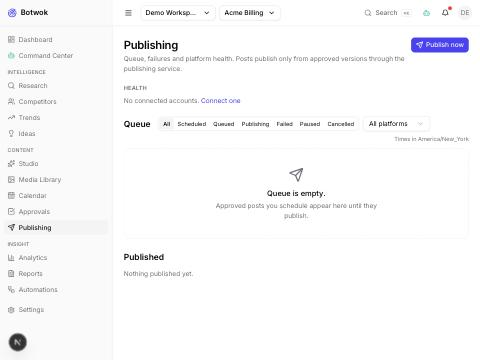

</td></tr></table>

## 17. Analytics

**Route:** `/w/{slug}/analytics`  
**What happens here:** KPIs with basis/coverage footnotes, engagement over time, by platform/pillar/format, best-hours heatmap, top posts, insights.  
**Verified:** Shows 'n/a — not provided by the connected platforms' rather than zeros when no metrics exist.

<table><tr><th width="50%">Wireframe (design)</th><th width="50%">Built screen</th></tr><tr><td>

```text
┌──────────────────────────────────────────────────────────────────────────────────────────────────┐
│ Analytics · Acme Coffee  Last 30 days ▾ vs prev ▾  Platform ▾ Campaign ▾  (Sync now) (Export ▾)  │
├───────────────────────┬────────────────────────┬────────────────────────┬────────────────────────┤
│ Impressions  212k     │ Engagements  9.8k      │ Eng. rate    4.6%      │ Followers   +1.2k      │
│ ▲ 14%  ▁▂▃▅▆▇         │ ▲ 9%   ▁▃▃▅▅▆          │ ▼ 0.2 pt               │ ▲ 6%  (li ig yt)       │
├───────────────────────┴────────────────────────┼────────────────────────┴────────────────────────┤
│ Engagement over time     ◉ day ○ week          │ By platform (eng. rate)                         │
│ ▁▂▂▃▅▃▄▆▅▇▆▅▆▇  ━ this ┄ prev                  │ li ▓▓▓▓▓▓▓▓ 5.3%   ig ▓▓▓▓▓▓ 4.1%               │
│                                                │ x  ▓▓▓ 1.9%   th  n/a ⓘ                         │
├────────────────────────────────────────────────┼─────────────────────────────────────────────────┤
│ By pillar · By format   [tabs]                 │ Best hours (heatmap, eng. rate)                 │
│ Education ▓▓▓▓▓▓▓ 5.9%  carousel ▓▓▓▓▓▓ 6.1%   │      06  09  12  15  18  21                     │
│ Product   ▓▓▓▓ 3.8%     video    ▓▓▓▓ 4.0%     │ Mon  ░░  ▓▓  ▒▒  ░░  ▒▒  ░░                     │
│                                                │ Tue  ░░  ██  ▓▓  ░░  ▒▒  ░░                     │
├────────────────────────────────────────────────┴─────────────────────────────────────────────────┤
│ ⓘ Normalized metrics: not all platforms expose all metrics. n/a = not provided, not zero.        │
│ TOP POSTS  Post · Platform · Published · Impr. · Eng. · Eng. rate · Saves · Clicks · ✦ Why       │
└──────────────────────────────────────────────────────────────────────────────────────────────────┘
```

</td><td>

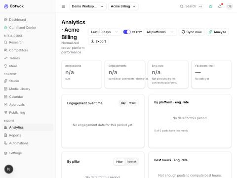

</td></tr></table>

## 18. Reports

**Route:** `/w/{slug}/reports`  
**What happens here:** Report list, generate wizard (kind, period, brand, recipients), viewer with sections and sources, export.  
**Verified:** Weekly performance report generated by the worker from stored data (deterministic data pack; AI narrative added when a provider key exists); viewer shows sections, basis/coverage table, export and regenerate.

<table><tr><th width="50%">Wireframe (design)</th><th width="50%">Built screen</th></tr><tr><td>

```text
┌────────────────────────┬─────────────────────────────────────────────────────────────────────────┐
│ REPORTS   [+ Generate] │ Weekly performance · Acme Coffee · Sep 29–Oct 5      ✦ report           │
│ Type ▾  Brand ▾        │ Generated Oct 6 08:02 · 3 sections · 11 sources · $0.06 (run ↗)         │
│ ● Weekly perf · Oct 6  │ (Export PDF) (Export Markdown) (Send ▾) (Regenerate) (Schedule)         │
│ ● Competitor · Sep 30  │ ────────────────────────────────────────────────────────────────────────│
│ ⟳ Campaign Q4 · running│ 1 Summary            ✦  Reach +12%, carousels led engagement [1][2]     │
│ ✗ Custom · failed      │ 2 Top posts          table · data: analytics snapshot Oct 6 06:00       │
│ SCHEDULED (2)          │ 3 Competitors        ✦  Brew Bros doubled tt cadence [3]                │
│ Weekly perf · Mon 08:00│ 4 Recommendations    ✦  3 items · (Send to Calendar ▸)                  │
│ → email, #marketing    │ Sources  [1] analytics: li posts … [2] ig posts … [3] competitor sync   │
└────────────────────────┴─────────────────────────────────────────────────────────────────────────┘
```

</td><td>

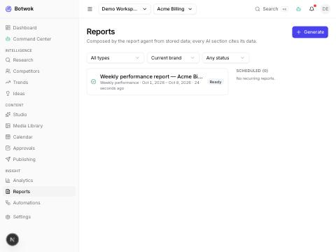

</td></tr></table>

## 19. Automations

**Route:** `/w/{slug}/automations`  
**What happens here:** Workflow list, React Flow builder with node palette (Trigger, Condition, AI Agent, Research, Generate, Transform, Approve, Schedule, Publish, Wait, Webhook, Notification, Analytics, Action), templates, run history.  
**Verified:** Created the 'Industry news → LinkedIn post' workflow from the server template; the React Flow builder shows the node chain (trend → research → 5 ideas → draft → human approval → schedule), node palette, on-error policy and cost cap; a dry run executed through the worker and paused on its AI step (no provider keys).

<table><tr><th width="50%">Wireframe (design)</th><th width="50%">Built screen</th></tr><tr><td>

```text
┌──────────────────────────────────────────────────────────────────────────────────────────────────┐
│ ◀ Automations / News → LinkedIn   ● Enabled   v4 saved 2m   (Test run) (Runs) (Save) [Disable]   │
├───────────────┬───────────────────────────────────────────────────────┬──────────────────────────┤
│ NODES         │ ↯ WHEN new industry news detected  (rss: 3 feeds)     │ ◇ Condition         ✕    │
│ ↯ Trigger     │        │                                              │ Name [relevance gate]    │
│ ◇ Condition   │ ◇ IF relevance > 80 ──── no ───▶ ⊘ end                │ Field [trigger.relevance]│
│ ✦ AI Agent    │        │ yes                                          │ Operator [ > ▾ ]         │
│ ⌕ Research    │ ⌕ Research: deepen story · research agent             │ Value    [ 80 ]          │
│ ✎ Generate    │        │                                              │ No branch → [end ▾]      │
│ ⇄ Transform   │ ✦ Ideas ×3 · ideation · pick top 1                    │ ───────────────────────  │
│ ✓ Approve     │        │                                              │ TEST                     │
│ ◷ Schedule    │ ✎ Generate LinkedIn post · writer → critic            │ Use last event ▸         │
│ ➤ Publish     │        │                                              │ Result 86 → yes ✓        │
│ ⧗ Wait        │ ✓ Approval · role approver · expires 24h              │ (Test node)              │
│ ⇢ Webhook     │        │                                              │                          │
│ ◔ Notification│ ◷ Schedule · next best time on li                     │                          │
│ ▤ Analytics   │ (+ drop node)       zoom ⊖ ⊕  fit ⤢                   │                          │
│ ⚙ Action      │                                                       │                          │
└───────────────┴───────────────────────────────────────────────────────┴──────────────────────────┘
```

</td><td>

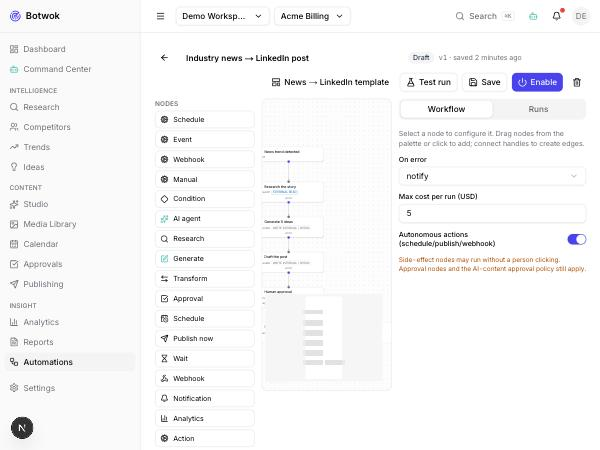

</td></tr></table>

## 20. Social Accounts

**Route:** `/w/{slug}/settings/social`  
**What happens here:** Account cards with status/token expiry/scopes/capabilities; connect buttons per platform with real requirement explainers.  
**Verified:** All nine platforms offered; connect flow redirects to the platform's OAuth page once app credentials are set in .env.

<table><tr><th width="50%">Wireframe (design)</th><th width="50%">Built screen</th></tr><tr><td>

```text
┌──────────────────────────────────────────────────────────────────────────────────────────────────┐
│ Social Accounts · Acme Coffee                               Status ▾  Platform ▾   [+ Connect]   │
├────────────────────────────────────────────────┬─────────────────────────────────────────────────┤
│ li  Acme Coffee · Organization  ● active       │ ig  @acmecoffee · Business      ○ expired       │
│ Token: 41 days left  ▓▓▓▓▓▓▓░░                 │ Token expired 2d ago · 3 posts at risk          │
│ Scopes w_organization_social,                  │ Scopes instagram_basic,                         │
│   r_organization_social (2 more ▸)             │   instagram_content_publish (+2 ▸)              │
│ CAN  text ✓ image ✓ video ✓ document ✓         │ CAN  image ✓ carousel ✓ reels ✓ story ✓         │
│ poll ✗ analytics ✓ native schedule ✗           │ text-only ✗ analytics ✓                         │
│ (Test) (Reconnect) (Disconnect)                │ [Reconnect]  (Disconnect)                       │
├────────────────────────────────────────────────┴─────────────────────────────────────────────────┤
│ CONNECT   (fb Page) (ig) (th) (li) (x) (tt) (yt) (pi) (gbp)    → each opens a requirements check │
└──────────────────────────────────────────────────────────────────────────────────────────────────┘
```

</td><td>

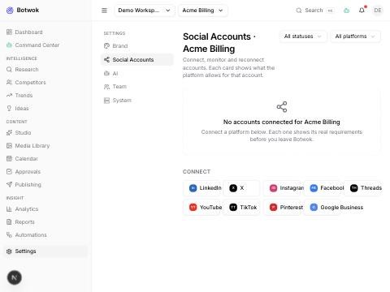

</td></tr></table>

## 21. Brand Settings

**Route:** `/w/{slug}/settings/brand`  
**What happens here:** Tabs Profile · Audience · Voice & Style · Visual Identity · Content Pillars · Keywords/Hashtags/CTAs · Goals; import from website; preview of the AI context.  
**Verified:** Seeded brand (Acme Billing) with settings and 10 default pillars loaded from the API.

<table><tr><th width="50%">Wireframe (design)</th><th width="50%">Built screen</th></tr><tr><td>

```text
┌──────────────────────────────────────────────────────────────────────────────────────────────────┐
│ Brand Settings · Acme Coffee   (✦ Import from website) (✦ Learn from my past posts)   [Save]     │
├──────────────────────────────────────────────────────────────────────────────────────────────────┤
│ Profile Audience [Voice & Style] Visual Pillars Keywords·Hashtags·CTAs Goals Competitors         │
├────────────────────────────────────────────────────┬─────────────────────────────────────────────┤
│ Tone                 (✦ Learn from my past posts)  │ BRANDCONTEXT PREVIEW  v12  (Copy JSON)      │
│ Casual ├──────●──────┤ Formal                      │ {                                           │
│ Playful ├────●────────┤ Serious                    │  "brand": "Acme Coffee",                    │
│ Concise ├───●─────────┤ Detailed                   │  "voice": {"formality": 0.6, …},            │
│ Writing samples (3)  (+ Add) (✦ From posts)        │  "pillars": [ 4 items ],                    │
│ Vocabulary  use: brew, roast · avoid: cheap        │  "forbidden_topics": [ … ],                 │
│ Forbidden topics  politics · health claims         │  "audience": "home baristas 25–45",         │
│ Preferred topics  sourcing · home brewing          │ }  ≈ 1.8k tokens · sent to all agents       │
│ Emoji ◉ sparing ○ none ○ frequent                  │  ✦ fields marked: from website import       │
└────────────────────────────────────────────────────┴─────────────────────────────────────────────┘
```

</td><td>

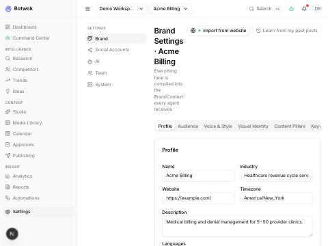

</td></tr></table>

## 22. AI Settings

**Route:** `/w/{slug}/settings/ai`  
**What happens here:** Provider keys (stored encrypted, shown as last4), model routing per tier and per agent, local model detection, budgets, safety thresholds, prompt templates, usage/cost dashboard.  
**Verified:** Provider table lists Anthropic/OpenAI/Google/xAI/Tavily/Brave/Exa/ElevenLabs with 'Add key' actions.

<table><tr><th width="50%">Wireframe (design)</th><th width="50%">Built screen</th></tr><tr><td>

```text
┌──────────────────────────────────────────────────────────────────────────────────────────────────┐
│ AI Settings   [Providers & routing] Budgets  Approvals  Prompts  Safety                  [Save]  │
├────────────────────────────────────────────────┬─────────────────────────────────────────────────┤
│ PROVIDER KEYS                                  │ MODEL ROUTING (per tier)                        │
│ LLM provider A   ● valid    (Rotate)           │ cheap     provider A · model-s   $/1M 0.2       │
│ LLM provider B   ○ not set  (Add key)          │ balanced  provider B · model-m   $/1M 3.0       │
│ Image provider   ● valid                       │ powerful  provider A · model-l   $/1M 15        │
│ Search provider  ⚠ quota 92%                   │ fallback  ☑ on provider error → next tier       │
│ Ollama  ● localhost:11434                      │ AGENT OVERRIDES                                 │
│   detected: llama3.1:8b, qwen2.5:14b           │ critic   → provider B · model-m (≠ writer)      │
│ Embeddings [provider A ▾]  Video [—▾]          │ ideation → ollama/llama3.1:8b (local)           │
└────────────────────────────────────────────────┴─────────────────────────────────────────────────┘
```

</td><td>

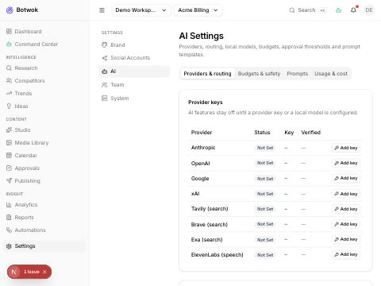

</td></tr></table>

## 23. Team

**Route:** `/w/{slug}/settings/team`  
**What happens here:** Members with role select, invite dialog, pending invitations, role explanations.  
**Verified:** Owner row rendered from GET members.

<table><tr><th width="50%">Wireframe (design)</th><th width="50%">Built screen</th></tr><tr><td>

```text
┌──────────────────────────────────────────────────────────────────────────────────────────────────┐
│ Team · Acme Co      [Members] Invitations (2)  Roles  Activity          (Search)  [+ Invite]     │
├──────────────────────────────────────────────────────────────────────────────────────────────────┤
│ Member                 Email               Role          Brands       Last active                │
│ (SB) Sam Branch        sam@…               owner         all          now           ⋯            │
│ (JL) Jo Li             jo@…                admin ▾       all          2h            ⋯            │
│ (RK) Ravi K            ravi@…              approver ▾    Acme Coffee  1d            ⋯            │
│ (MT) Mia T             mia@…               editor ▾      all          5d            ⋯            │
└──────────────────────────────────────────────────────────────────────────────────────────────────┘
```

</td><td>


</td></tr></table>

## 24. System Settings

**Route:** `/w/{slug}/settings/system`  
**What happens here:** Workspace general, notification channels, API keys, export/backup, danger zone, admin/debug (health, jobs, events, costs).  
**Verified:** General tab renders with timezone, retention and channel toggles; admin panel reads /admin/*.

<table><tr><th width="50%">Wireframe (design)</th><th width="50%">Built screen</th></tr><tr><td>

```text
┌──────────────────────────────────────────────────────────────────────────────────────────────────┐
│ System Settings · Acme Co                                                               [Save]   │
├───────────────────┬──────────────────────────────────────────────────────────────────────────────┤
│ General           │ NOTIFICATIONS                                                                │
│ Notifications     │ Event                     In-app  Email  Slack  Webhook                      │
│ Timezone & locale │ Approval requested        ☑       ☑      ☑      ☐                            │
│ Data retention    │ Publish failed            ☑       ☑      ☑      ☑                            │
│ Export & backup   │ Token expiring            ☑       ☑      ☐      ☐                            │
│ API keys          │ Budget threshold          ☑       ☑      ☐      ☐                            │
│ Danger zone       │ Channels  Email ● smtp ok · Slack ● #marketing · Webhook ○ (Add)             │
│ ────────────────  │                                                                              │
│ Admin / Debug ↗   │                                                                              │
└───────────────────┴──────────────────────────────────────────────────────────────────────────────┘
```

</td><td>

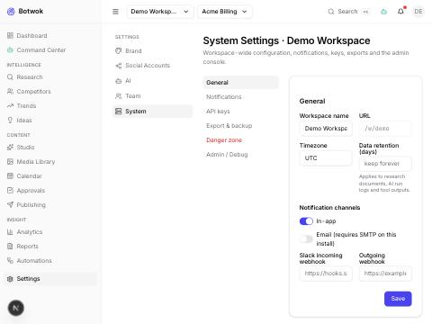

</td></tr></table>
